# 📈 AI Stock Trading Simulation System

A multi-agent stock trading simulator with reinforcement learning capabilities, featuring three distinct AI trader types that evolve through iterative learning and experience sharing.

## ✨ Key Features

- **Three Intelligent Trader Types**: Emotional Investor vs Rational Fund Manager vs Insider Trader
- **Reinforcement Learning System**: AI agents learn from each trade outcome using Q-learning algorithms
- **Iterative Learning Enhancement**: Continuous strategy optimization through experience accumulation
- **Market Pattern Recognition**: Advanced technical analysis and trend detection
- **Meta-cognition System**: Agents understand their strengths/weaknesses and learn from mistakes
- **Multi-round Evolution**: Traders become smarter across simulation rounds

## 🏗️ Project Structure

```
stock-trading-simulation/
├── stock_simulation.py      # ⭐ Main simulation file (complete system)
├── requirements.txt         # Python dependencies
├── README.md               # Documentation
├── .env.example            # Environment variables template
├── trader_*/               # Individual trader learning models
│   ├── rl_model.json       # Reinforcement learning Q-table
│   ├── strategy_optimizer.json  # Strategy performance data
│   └── pattern_recognizer.json  # Market pattern recognition data
├── stock_database.json     # Generated stock market data
└── output_files/           # Simulation results
    ├── trading_conversations_round_X.json
    ├── trading_experience_memory_round_X.json
    └── trading_performance_round_X.json
```

## 📈 Stock Trading Simulation System Flowchart

 ## 🔄 Simplified Core Flowchart

```mermaid
    graph TD
    
    A[🚀 Start Simulation] --> B[📊 Generate Data]
    A --> C[🤖 Create 3 AI Traders]
    A --> D[💾 Load Models]
    
    B --> E{4 Weeks Loop}
    
    E --> F[📅 Weekly Trading]
    F --> G{7.5 Days Loop}
    
    G --> H[📢 Commentary]
    G --> I[📰 News Reaction]
    G --> J[🤝 Execute Trades]
    
    J --> K[🎭 Emotional]
    J --> L[🧠 Rational]
    J --> M[🕵️ Insider]
    
    J --> N[📈 Calculate Profit]
    N --> O[🧠 Reinforcement Learning]
    
    E --> P[📊 Weekly Summary]
    P --> Q[💬 Strategy Discussion]
    P --> R[🗣️ Experience Sharing]
    
    E --> S[💾 Save Progress]
    
    S --> T{Continue?}
    T -->|Yes| E
    T -->|No| U[🎉 Complete]
    
    U --> V[🏆 Best Trader]
    U --> W[📋 Generate Reports]
```

## 🚀 Quick Start

### 1. Install Dependencies

```bash
pip install -r requirements.txt
```

Required packages:
- pandas >= 2.0.0
- numpy >= 1.24.0
- python-dotenv >= 1.0.0
- openai >= 1.0.0

### 2. Configure API Key

Create a `.env` file with your DeepSeek API key:

```bash
# .env file content
DEEPSEEK_API_KEY=your_deepseek_api_key_here
```

**Getting API Key**:
1. Visit [DeepSeek Platform](https://platform.deepseek.com/)
2. Register and login
3. Create a new API Key in the "API Keys" section
4. Copy the API Key into your `.env` file

### 3. Run the Simulation

**Basic single-round simulation (30 days)**:
```bash
python stock_simulation.py
```

**Multi-round simulation (3 rounds)**:
```bash
python stock_simulation.py --rounds 3
```

**Fast mode (reduced commentary)**:
```bash
python stock_simulation.py --fast
```

**Reset learning models (start fresh)**:
```bash
python stock_simulation.py --reset-learning
```

## 🤖 AI Trader Types

### 1. 🎭 Emotional Investor
- **Trading Style**: Emotion-driven, herd mentality, impulsive decisions
- **Learning Focus**: Emotional resilience, mistake memory, panic control
- **Strategy**: Market sentiment and price volatility based trading
- **Personality Traits**: High emotional volatility, strong herd mentality, impulsive

### 2. 🧠 Rational Fund Manager
- **Trading Style**: Analytical, disciplined, technical analysis based
- **Learning Focus**: Trend model accuracy, pattern recognition, risk management
- **Strategy**: Fundamental and technical analysis based rational investing
- **Personality Traits**: High analytical skills, patience, discipline

### 3. 🕵️ Insider Trader
- **Trading Style**: Information advantage, opportunistic, aggressive
- **Learning Focus**: Information reliability, timing accuracy, source validation
- **Strategy**: Insider information advantage based trading
- **Personality Traits**: Secretive, opportunistic, aggressive

## 🔄 Simulation Flow

### Daily Trading Process
1. **Market Commentary**: Top-performing traders share market insights
2. **News Reaction**: Traders react to market news events
3. **Trading Decisions**: Each trader makes buy/sell decisions
4. **Trade Execution**: Transactions are executed at current prices
5. **Learning Phase**: Agents analyze outcomes and update strategies

### Weekly Learning Cycle
1. **Performance Review**: Calculate weekly returns and portfolio values
2. **Strategy Discussion**: Top traders discuss trading strategies
3. **Experience Sharing**: All traders share lessons learned
4. **Peer Learning**: Less experienced traders learn from top performers
5. **Strategy Integration**: Integrate successful strategies

## 🧠 Learning Mechanisms

### Reinforcement Learning System
- **Q-learning Algorithm**: State-action-reward based learning
- **Exploration-Exploitation Balance**: Dynamic adjustment of learning parameters
- **State Representation**: Stock, action, market condition, trader confidence
- **Reward System**: Profit-based reward scaling

### Strategy Optimization
- **Performance Tracking**: Record strategy success rates
- **Contextual Adaptation**: Adjust strategies based on market conditions
- **Strategy Variation**: Generate creative strategy modifications

### Pattern Recognition
- **Technical Analysis**: Price patterns, volatility, momentum
- **Historical Success Rates**: Track pattern prediction accuracy
- **Adaptive Advice**: Generate trading recommendations based on patterns

## 📊 Output and Results

### Generated Files
- **stock_database.json**: 30-day stock data for 10 major tech stocks
- **trading_conversations_round_X.json**: Complete conversation logs
- **trading_experience_memory_round_X.json**: Individual trader memories and learnings
- **trading_performance_round_X.json**: Performance metrics and returns
- **trader_*/**: Persistent learning models for each trader

### Performance Metrics
- **Weekly Returns**: Per-trader weekly performance
- **Total Returns**: Overall simulation performance
- **Learning Progress**: Individual learning progression (0-100%)
- **Portfolio Analysis**: Holdings, cash positions, portfolio values

## ⚙️ Configuration Options

### Command Line Arguments
```bash
--days DAYS         Simulation days (default: 30)
--weeks WEEKS       Simulation weeks (default: 4)
--rounds ROUNDS     Number of simulation rounds (default: 1)
--fast              Fast mode (reduced commentary)
--reset-learning    Reset learning models
```

### Simulation Parameters
- **Initial Capital**: $100,000 per trader
- **Trading Days**: 30 days (4 weeks of 7.5 trading days)
- **Stock Universe**: 10 major tech stocks (AAPL, GOOGL, MSFT, etc.)
- **Learning Rate**: 0.1 (RL system)
- **Discount Factor**: 0.95 (RL system)

## 📈 Example Output

```
================================================================================
                            📅 Week 1 Trading (Round 1)
================================================================================

--- Day 1 ---

📢 Day 1 Market Commentary

情绪投资者 (学习进度: 0.0%) 发表市场评论:
情绪投资者: 作为一个情绪投资者，我看到市场波动就兴奋...

💰 Week 1 Returns:
   情绪投资者: 周收益 +1.23%, 总收益 +1.23%, 学习进度 5.2%
   理性基金经理: 周收益 +0.89%, 总收益 +0.89%, 学习进度 3.8%
   信息泄露者: 周收益 +2.45%, 总收益 +2.45%, 学习进度 8.1%

================================================================================
                              ✅ Simulation Complete
================================================================================

🏆 Monthly Best Trader: 信息泄露者 (综合得分: 0.82)
📚 Most Learning Progress: 情绪投资者 (学习进度: 35.6%)

✅ All results saved to JSON files!
💾 Trader learning models saved for next round
```

## 🔧 Customization

### Adding New Trader Types
1. Create new trader class inheriting from `BaseTrader`
2. Implement `make_trading_decisions` method
3. Define unique personality traits
4. Add to simulation initialization

### Modifying Market Parameters
- Edit `StockDataGenerator` class for different stock selection
- Adjust price generation parameters in `generate_stock_data`
- Modify `_generate_market_news` for custom news events

### Adjusting Learning Parameters
- Modify `ReinforcementLearningSystem` parameters
- Adjust `TradingStrategyOptimizer` adaptation rates
- Configure `MarketPatternRecognizer` thresholds

## 📝 FAQ

### Q: API call failed, what should I do?
A: Check:
1. Correct API key in `.env` file
2. Network connectivity
3. DeepSeek API service status
4. Sufficient API credits

### Q: Simulation runs too slow?
A: Try:
1. Use `--fast` mode
2. Reduce simulation days (`--days 15`)
3. Reduce number of stocks in `StockDataGenerator`

### Q: How to interpret the learning progress percentage?
A: Learning progress (0-100%) indicates:
- 0-30%: Exploration phase, making basic trades
- 30-60%: Learning phase, improving strategies
- 60-90%: Optimization phase, refining approaches
- 90-100%: Mastery phase, consistent performance

### Q: Can I use different LLM APIs?
A: Yes! Modify the `AIClient` class:
```python
# Change to OpenAI
self.client = OpenAI(api_key=os.getenv("OPENAI_API_KEY"))
self.model = "gpt-4"
```

## 🧪 Testing

Verify the system:
```bash
# Check Python syntax
python -m py_compile stock_simulation.py

# Test imports
python -c "import pandas; import numpy; print('Dependencies OK')"

# Run quick test
python stock_simulation.py --fast --days 5
```

## 🤝 Contributing

Issues and Pull Requests are welcome! Key areas for contribution:
- New trader types with unique strategies
- Additional technical indicators
- Enhanced learning algorithms
- Visualization tools for results

## 📄 License

MIT License

## 🙏 Acknowledgments

- [DeepSeek AI](https://www.deepseek.com/) for powerful LLM API
- [OpenAI Python SDK](https://github.com/openai/openai-python) for API client
- [Pandas](https://pandas.pydata.org/) and [NumPy](https://numpy.org/) for data processing

---

**📈 Start your AI trading simulation journey! Watch intelligent agents evolve from novice traders to market masters through reinforcement learning and experience sharing.**